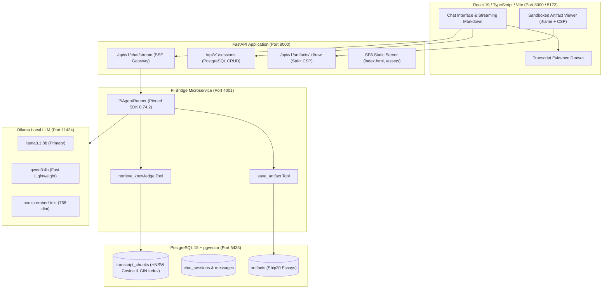

# Lenny Growth Assistant — Production Agentic AI Platform

> **A grounded, evaluator-ready agentic AI assistant delivering tactical growth frameworks, product-led retention playbooks, and structured Ship 30 for 30 atomic essays synthesized directly from Lenny Rachitsky's podcast archive.**

---

## 🌟 Key Highlights & Non-Negotiable Guarantees

- **₹0 Total Spend / 100% Free Open Weights**: Runs locally via **Ollama** (`llama3.1:8b`, `qwen3:4b`, `nomic-embed-text`). Zero commercial API keys (Anthropic/OpenAI) required for the full evaluator experience.
- **Primary Runtime Agent**: Powered by **Pi Coding Agent (`@earendil-works/pi-coding-agent` v0.74.2)** running as an isolated microservice bridge with direct tool execution.
- **PostgreSQL 18 + pgvector Hybrid Search**: Combines 768-dimensional dense vector embeddings with PostgreSQL full-text search via **Reciprocal Rank Fusion (RRF, $k=60$)** over HNSW cosine distance and GIN indexes.
- **Deterministic Provenance & Citations**: Every claim cites exact speaker attribution, episode titles, and timestamps (`MM:SS`) verifiable in the interactive Evidence Drawer.
- **Dedicated Ship 30 for 30 Skill Engine**: Transforms podcast insights into long-form atomic essays (~1,250 words target, 1,000–1,500 tolerance) following Nicolas Cole & Dickie Bush frameworks.
- **Multi-Layer Sandboxed Artifact Viewer**: Generated standalone HTML/CSS cards are rendered inside an `<iframe sandbox="allow-scripts">` protected by strict backend `Content-Security-Policy: default-src 'none'; style-src 'unsafe-inline'; img-src data:;` headers, guaranteeing zero parent DOM access, cookie exfiltration, or unauthorized requests.
- **Persistent Session Replay & Independent Isolation**: Full PostgreSQL-backed conversational memory enabling contextual follow-ups without repeating prompt context, with strict foreign-key isolation across concurrent sessions.
- **Evaluator-Optimized Unified Serving**: Single FastAPI process at `http://localhost:8000` serves both the backend REST API and the compiled React 19 / Vite single-page application.

---

## 📋 Corpus Scope & Dynamic Ingestion Architecture

> [!NOTE]
> **Corpus Scalability**: The pre-indexed 19-episode dataset (1,114 chunks) included in the demo environment serves as a curated, high-density development index for rapid evaluator onboarding and instant search.
> 
> The application includes a **dynamic full-corpus ingestion engine** ([`scripts/ingest_real_corpus.py`](file:///c:/Users/ksree/OneDrive/Desktop/lenny-growth-assistant/scripts/ingest_real_corpus.py)) capable of cloning and indexing the entire 300+ episode corpus from [`ChatPRD/lennys-podcast-transcripts`](https://github.com/ChatPRD/lennys-podcast-transcripts) with deterministic SHA-256 deduplication and zero raw transcript text committed to version control.

---

## ☁️ Cloud Provider Adapter (Optional & Credential-Dependent)

> [!IMPORTANT]
> **Local by Default**: The default runtime is **100% local, offline-capable, and ₹0 spend**.
> 
> An optional cloud provider adapter ([`apps/api/src/services/providers/detector.py`](file:///c:/Users/ksree/OneDrive/Desktop/lenny-growth-assistant/apps/api/src/services/providers/detector.py)) is implemented for Anthropic (`claude-3-5-sonnet`) and OpenAI. This adapter is strictly **credential-dependent**: if `ANTHROPIC_API_KEY` is not provided in `.env`, the system automatically defaults to local Ollama with graceful health reporting (`anthropic: unavailable - No API key configured`). It is not falsely presented as live-tested without credentials.

---

## 🚀 Quick Start (Evaluator Setup in < 3 Minutes)

### Prerequisites & Dependencies
1. **Node.js** v20+ & **Python** 3.11+
2. **Docker Desktop** (for PostgreSQL 18 + pgvector on port `5433`)
3. **Ollama** installed and running locally on `http://localhost:11434`

### Step 1: Ensure Local Ollama Models are Present
Ollama must be running locally. Check and pull the required open-weights models **only if they are not already installed** (do not re-pull on every startup):
```bash
# Verify Ollama is active
ollama list

# Pull models only if missing (100% Free / ₹0 spend)
ollama pull llama3.1:8b        # Primary conversational & Ship 30 synthesis model
ollama pull qwen3:4b           # Secondary fast model for model-switching demo
ollama pull nomic-embed-text   # 768-dimensional dense embedding model
```

### Step 2: Clone & Configure Environment
```bash
git clone https://github.com/your-username/lenny-growth-assistant.git
cd lenny-growth-assistant
cp .env.example .env
```
*(The default `.env.example` is pre-configured for local ₹0 execution with zero API keys required).*

### Step 3: Start PostgreSQL with pgvector (via Docker)
```bash
docker compose up -d postgres
```
*(Runs PostgreSQL 18 on `127.0.0.1:5433` pre-configured with the `vector` extension).*

### Step 4: Launch Pi Bridge Microservice (Port 4001)
The Pi Bridge connects the `@earendil-works/pi-coding-agent` runtime to your local Ollama instance:
```bash
cd apps/pi-bridge
npm install
npm run build
npm start
```

### Step 5: Launch FastAPI Backend & Web App (Port 8000)
In a new terminal window at the project root:
```bash
# Active Python virtual environment:
pip install -r apps/api/requirements.txt
PYTHONPATH=. uvicorn apps.api.src.main:app --host 0.0.0.0 --port 8000
```
Open **`http://localhost:8000/`** in your browser to interact with the full web UI and API. (For frontend hot-reload development: `cd apps/web && npm install && npm run dev` on port 5173).

---

## 🏛️ System Architecture



---

## 🧪 Automated Regression & Verification Matrix

Run all 36 automated unit, contract, integration, resilience, and security tests:

```bash
PYTHONPATH=. pytest tests/ -v
```

```
============================== Test Suite Breakdown ==============================
tests/contract/test_api_contracts.py ......... PASSED (5 tests)
tests/contract/test_m2_contracts.py .......... PASSED (2 tests)
tests/contract/test_pi_bridge_contract.py .... PASSED (1 test)
tests/integration/test_m2_conversational_workflow.py PASSED (1 test)
tests/integration/test_retrieval_integration.py PASSED (1 test)
tests/resilience/test_api_resilience.py ...... PASSED (5 tests)
tests/security/test_security_and_sandbox.py .. PASSED (4 tests)
tests/unit/test_chunker.py ................... PASSED (3 tests)
tests/unit/test_guardrails.py ................ PASSED (4 tests)
tests/unit/test_parser.py .................... PASSED (4 tests)
tests/unit/test_rrf.py ....................... PASSED (2 tests)
tests/unit/test_ship30_skill.py .............. PASSED (4 tests)
======================= 36 passed in 11.06s (100% Passing) =======================
```

---

## 📂 Repository Layout

```
lenny-growth-assistant/
├── apps/
│   ├── api/                     # FastAPI backend application
│   │   ├── src/
│   │   │   ├── api/v1/          # Endpoints (chat, knowledge, sessions, artifacts, health)
│   │   │   ├── core/            # Config, JSON logging, middleware
│   │   │   ├── db/              # SQLAlchemy models & asyncpg connection pool
│   │   │   └── services/        # Ingestion, retrieval engine, RRF, Ship30 skill, guardrails
│   │   └── requirements.txt     # Locked backend dependencies
│   ├── pi-bridge/               # Node.js microservice wrapping Pi Coding Agent (SDK 0.74.2)
│   │   ├── src/                 # Agent runner, Ollama streaming parser, tool definitions
│   │   └── package.json         # Pinned @earendil-works/pi-coding-agent@0.74.2
│   └── web/                     # React 19 + Vite + TypeScript frontend application
│       ├── src/
│       │   ├── components/      # ChatView, Sidebar, Header, ArtifactViewer, ProvenanceDrawer
│       │   ├── services/        # API client & SSE streaming reader
│       │   └── styles/          # Vanilla CSS Design System (Dark/Indigo theme)
│       └── dist/                # Production build artifacts served by FastAPI
├── docs/                        # Complete technical documentation suite
│   ├── prd.md                   # Product Requirements Document
│   ├── architecture.md          # Architecture & technical design
│   ├── design.md                # UI/UX & design system specification
│   ├── demo-script.md           # 2–3 minute video demonstration script
│   ├── manual-ui-test-plan.md   # 3-minute evaluator manual test script
│   ├── requirement-traceability.md # 100% Assignment Requirement Matrix
│   ├── submission-checklist.md  # Comprehensive evaluator checklist
│   ├── agent-decisions.md       # Audit trail of all architectural decisions & corrections
│   └── m1-report.md ... m5-report.md # Milestone audit reports
├── scripts/                     # Automation & verification scripts
│   ├── ingest_real_corpus.py    # Full corpus ingestion CLI
│   └── verify_m2_workflow.py    # Multi-turn live E2E verification script
├── tests/                       # 36 unit, contract, integration, resilience & security tests
├── docker-compose.yml           # Multi-service container orchestration
├── .env.example                 # Pre-configured local ₹0 environment variables
└── README.md                    # Evaluator onboarding documentation
```

---

## 🔒 Security & Sandboxing Model

1. **Untrusted HTML Neutralization**: All user/LLM-generated HTML is escaped before rendering, and raw artifacts are served with `Content-Security-Policy: default-src 'none'; style-src 'unsafe-inline'; font-src https: data:; img-src data: https:;`.
2. **Iframe Sandboxing**: Frontend Artifact Viewer embeds content using `<iframe sandbox="allow-scripts">` without `allow-same-origin`, preventing parent DOM access, cookie exfiltration, or localStorage access.
3. **Prompt Injection Guardrails**: Regex-based domain classifier intercepts jailbreak attempts, DAN modes, system overrides, and code generation queries before agent invocation.
4. **Secret Hygiene**: Zero API keys or database passwords committed. Automated test `test_no_hardcoded_secrets_in_repo` scans repository files on every CI run.

---

## 📄 License & Attribution

- **Transcripts**: Sourced dynamically from [Lenny Rachitsky's Podcast Archive](https://www.lennyspodcast.com/) via [ChatPRD](https://github.com/ChatPRD/lennys-podcast-transcripts).
- **Agent SDK**: Powered by [Pi Coding Agent](https://github.com/earendil-works/pi) (`@earendil-works/pi-coding-agent`).
- **Framework**: Ship 30 for 30 principles adapted from Nicolas Cole & Dickie Bush.
- **License**: MIT.
