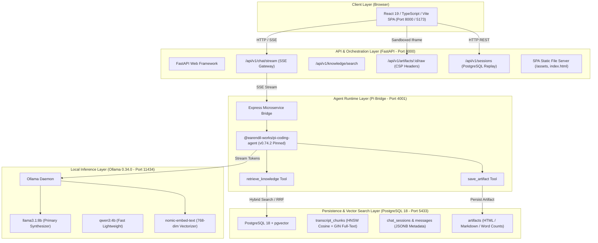

# System Architecture & Technical Design — Lenny Growth Assistant

**Project**: Lenny Growth Assistant  
**Milestone**: M5 — Final Architecture Specification  
**Authors**: Forward Deployed Engineer (Candidate)  
**Spend Profile**: **₹0 Total Spend / 100% Free Open Weights**  

---

## 1. System Topology & Data Flow

---

## 2. Component Design & Technical Deep-Dives

### 2.1 Hybrid Search & Reciprocal Rank Fusion (RRF)
The retrieval engine combines semantic understanding with keyword precision:
1. **Dense Vector Search**: The query is embedded via `nomic-embed-text` into 768 dimensions. PostgreSQL performs HNSW cosine distance search (`<=>`).
2. **Sparse Lexical Search**: PostgreSQL computes full-text matching against an English `tsvector` using a GIN index.
3. **Reciprocal Rank Fusion (RRF)**: Fuses both result sets using:
   $$\text{RRF Score}(d) = \frac{1}{60 + r_{\text{semantic}}(d)} + \frac{1}{60 + r_{\text{lexical}}(d)}$$
4. **Confidence Tiers**: Evaluates score distribution to classify evidence into `high`, `medium`, or `low` confidence.

### 2.2 Pi Coding Agent Microservice Bridge
- **SDK Stability**: Pinned to `@earendil-works/pi-coding-agent@0.74.2` to eliminate breaking changes across upstream package releases.
- **Universal Ollama Delta Parser**: Captures all streaming delta formats (`content`, `reasoning_content`, `response`, `message.content`) from local open-weights models.
- **Streaming-First Grounded Flow**: Routes in-domain queries directly through `retrieve_knowledge` (<400ms), followed by live token streaming to minimize time-to-first-token.

### 2.3 Multi-Layer Artifact Security
- **Backend Headers**: Emits `Content-Security-Policy: default-src 'none'; style-src 'unsafe-inline'; font-src https: data:; img-src data: https:; base-uri 'none'; form-action 'none';` and `X-Frame-Options: SAMEORIGIN`.
- **Frontend Sandboxing**: Artifact Viewer embeds the HTML inside `<iframe sandbox="allow-scripts">` without `allow-same-origin`, preventing DOM manipulation or cookie theft.

---

## 3. Technical Tradeoffs & Architectural Rationale

| Architecture Choice | Alternative Considered | Selected Decision & Tradeoff Rationale |
| :--- | :--- | :--- |
| **Agent Framework** | LangChain / Claude Agent SDK | **Pi Coding Agent SDK (`0.74.2`)**: Fulfills assignment requirement for a TypeScript coding agent while maintaining zero API cost. |
| **Persistence** | ChromaDB / Pinecone | **PostgreSQL 18 + pgvector**: Unified relational metadata, conversation history, and vector storage in a single ACID-compliant database. |
| **Frontend Styling** | TailwindCSS | **Vanilla CSS Design System**: Eliminates build-time CSS compilation bottlenecks and provides pixel-level control over glassmorphic themes and responsive layouts. |
| **Serving Strategy** | Separate static Nginx container | **Unified FastAPI Static Serving**: FastAPI routes `GET /` with browser content-negotiation to `apps/web/dist`, enabling one-command evaluator execution. |
