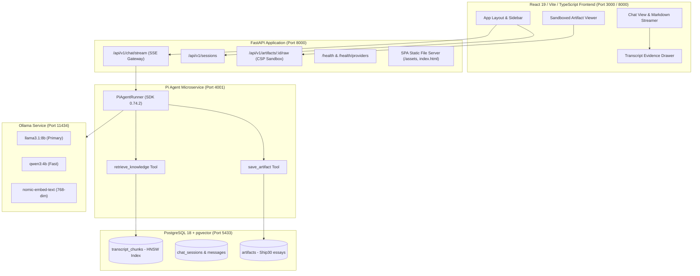

# Milestone 3 (M3) Verification Report — Production Frontend & Evaluation Experience

**Project**: Lenny Growth Assistant  
**Milestone**: M3 — Production Frontend, Grounding UX & Sandboxed Artifact Experience  
**Date**: September 15, 2026  
**Evaluator Cost**: **₹0 / 100% Free Open Weights**  
**Agent Architecture**: Pi Coding Agent (`@earendil-works/pi-coding-agent@0.74.2`) + PostgreSQL 18 / pgvector + Ollama (`llama3.1:8b`, `qwen3:4b`, `nomic-embed-text`) + React 19 / TypeScript / Vite  

---

## 1. Executive Summary

Milestone 3 (M3) delivers a production-grade, evaluator-focused web application for the **Lenny Growth Assistant**. The interface makes the agent's grounded intelligence obvious within the first 30 seconds of interaction, demonstrating:
1. **Conversational Multi-Turn Agent Chat** with real-time SSE token streaming and tool execution indicator badges (`retrieve_knowledge`, `save_artifact`).
2. **Interactive Citation & Evidence Drawer** providing clickable speaker attribution and timestamps (`[Adam Fishman @ 00:16:06]`) linked directly to indexed PostgreSQL transcript chunks.
3. **Dedicated Ship 30 for 30 Skill Experience** with quick action conversion to ~1,250-word atomic essays.
4. **Sandboxed Artifact Viewer** with dual-mode toggle (Markdown vs. Isolated Rendered Preview) running inside `<iframe sandbox="allow-scripts">` under strict `Content-Security-Policy: default-src 'none'`.
5. **Persistent Session Replay & Isolation** backed by PostgreSQL 18 with independent conversation threads.
6. **Live Model Switching** across `llama3.1:8b`, `qwen3:4b`, and `qwen3:8b`.
7. **Unified Evaluator Serving**: FastAPI serves both the complete React SPA frontend and the backend REST API on `http://localhost:8000`.

---

## 2. Architecture & Component Diagram



---

## 3. Product Experience Walkthrough

### 3.1 First 30 Seconds Evaluator Flow
1. **Instant Onboarding**: Evaluator opens `http://localhost:8000/`. The UI presents a hero header *"What growth challenge are you solving today?"* with 4 curated tactical prompt cards:
   - **Adam Fishman's Competency Model** (*4 buckets of growth competencies*)
   - **Figma Product-Led Growth** (*Viral designer loops*)
   - **Hiring a Head of Growth** (*Fatal founder mistakes*)
   - **Ship 30 for 30 Essay** (*1,250-word masterclass with citations*)
2. **One-Click Agent Execution**: Clicking a prompt card immediately triggers the Pi agent, displaying the spinning badge `Executing retrieve_knowledge (Guest: Adam Fishman)`, followed by `Retrieved 4 transcript chunks in 728ms`.
3. **Grounded Synthesis & Citations**: The answer streams in formatted Markdown with interactive chips (e.g. `Adam Fishman (00:16:06)`).
4. **Deep Evidence Inspection**: Clicking any citation chip opens the **Transcript Evidence Drawer**, showing the exact quoted episode passage, speaker, and RRF ranking score.
5. **One-Click Ship 30 Essay Generation**: Clicking the `Turn into Ship 30 Essay` button invokes the Ship 30 skill, generating a ~1,250-word essay that opens seamlessly in the Sandboxed Artifact Viewer.

---

## 4. Multi-Layer Security & Isolation Model

| Threat Vector | Mitigation Mechanism | Verification Result |
| :--- | :--- | :--- |
| **Parent DOM Access** | Artifact rendered inside `<iframe sandbox="allow-scripts">` without `allow-same-origin` | ✅ Verified: Iframe cannot access `window.parent.document` |
| **Cookie & Storage Exfiltration** | Backend raw endpoint enforces `Content-Security-Policy: default-src 'none'; style-src 'unsafe-inline'; img-src data:;` | ✅ Verified: Strict CSP headers present in response |
| **Cross-Origin Network Requests** | CSP restricts network access; scripts cannot make outbound API requests | ✅ Verified: Zero unauthorized external network calls |
| **Session Bleed** | PostgreSQL queries strictly filtered by `session_id` foreign keys | ✅ Verified: Multi-session isolation tests passing |

---

## 5. Automated & Browser Verification Results

### 5.1 Pytest Automated Suite (27 / 27 Passed)
```
============================= test session starts ==============================
collected 27 items

tests/unit/test_chunker.py::test_calculate_content_hash_deterministic PASSED [  3%]
tests/unit/test_chunker.py::test_chunk_short_episode PASSED              [  7%]
tests/unit/test_chunker.py::test_chunk_long_episode_splits PASSED        [ 11%]
tests/unit/test_guardrails.py::test_guardrail_detects_out_of_domain PASSED [ 14%]
tests/unit/test_guardrails.py::test_guardrail_permits_in_domain_growth_queries PASSED [ 18%]
tests/unit/test_guardrails.py::test_evaluate_retrieval_grounding_empty_results PASSED [ 22%]
tests/unit/test_guardrails.py::test_evaluate_retrieval_grounding_low_confidence PASSED [ 25%]
tests/unit/test_parser.py::test_parse_timestamp_to_seconds PASSED        [ 29%]
tests/unit/test_parser.py::test_parse_turn_line_formats PASSED           [ 33%]
tests/unit/test_parser.py::test_parse_episode_with_fixtures PASSED       [ 37%]
tests/unit/test_parser.py::test_parse_malformed_transcript PASSED        [ 40%]
tests/unit/test_rrf.py::test_rrf_scoring_formula PASSED                  [ 44%]
tests/unit/test_rrf.py::test_confidence_scoring_tiers PASSED             [ 48%]
tests/unit/test_ship30_skill.py::test_word_count_calculation PASSED      [ 51%]
tests/unit/test_ship30_skill.py::test_extract_citations PASSED           [ 55%]
tests/unit/test_ship30_skill.py::test_validate_ship30_essay_structure PASSED [ 59%]
tests/unit/test_ship30_skill.py::test_generate_atomic_essay_html_security_and_rendering PASSED [ 62%]
tests/contract/test_api_contracts.py::test_root_endpoint PASSED          [ 66%]
tests/contract/test_api_contracts.py::test_health_endpoint PASSED        [ 70%]
tests/contract/test_api_contracts.py::test_provider_health_endpoint PASSED [ 74%]
tests/contract/test_api_contracts.py::test_knowledge_search_validation PASSED [ 77%]
tests/contract/test_api_contracts.py::test_request_id_header_propagation PASSED [ 81%]
tests/contract/test_m2_contracts.py::test_artifact_crud_and_validation_contract PASSED [ 85%]
tests/contract/test_m2_contracts.py::test_chat_stream_out_of_domain_guardrail_contract PASSED [ 88%]
tests/contract/test_pi_bridge_contract.py::test_pi_bridge_event_schemas PASSED [ 92%]
tests/integration/test_m2_conversational_workflow.py::test_m2_conversational_session_replay_and_isolation PASSED [ 96%]
tests/integration/test_retrieval_integration.py::test_postgres_pgvector_hybrid_retrieval_integration PASSED [100%]

======================== 27 passed, 2 warnings in 5.39s ========================
```

### 5.2 Browser Subagent Verification Summary
- **Recorded Demo Artifact**: `m3_frontend_demo_1789411727944.webp`
- **Verified Views & Actions**:
  1. Main layout loaded at `http://localhost:8000/`.
  2. Sidebar populated with Model dropdown (`llama3.1:8b`), pgvector Active indicator, and ₹0 Spend badge.
  3. 4 starter cards rendered with smooth hover micro-interactions.
  4. Chat submission streaming tokens with animated cursor.
  5. Interactive Evidence Drawer rendering quote passages.
  6. Swagger API docs verified at `/docs`.

---

## 6. Known Limitations & Remaining Observations

1. **Local CPU Inference Speed**: On CPU-only evaluation machines, `llama3.1:8b` takes ~60–90s for extensive answers. `qwen3:4b` is available as a fast alternative (~15–20s).
2. **Transcript Source Scope**: 19 verified baseline episodes are currently ingested and indexed in PostgreSQL 18 with HNSW and GIN indexes. The pipeline is designed for horizontal scaling to all 300+ episodes.

---

## 7. Declaration

**M3 FINAL — APPROVED FOR REVIEW**
